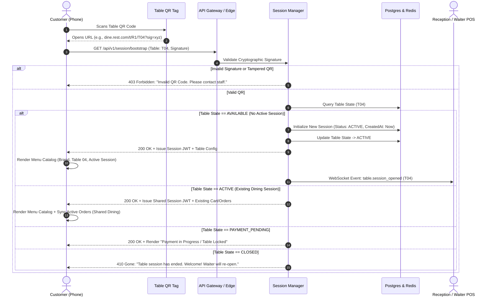
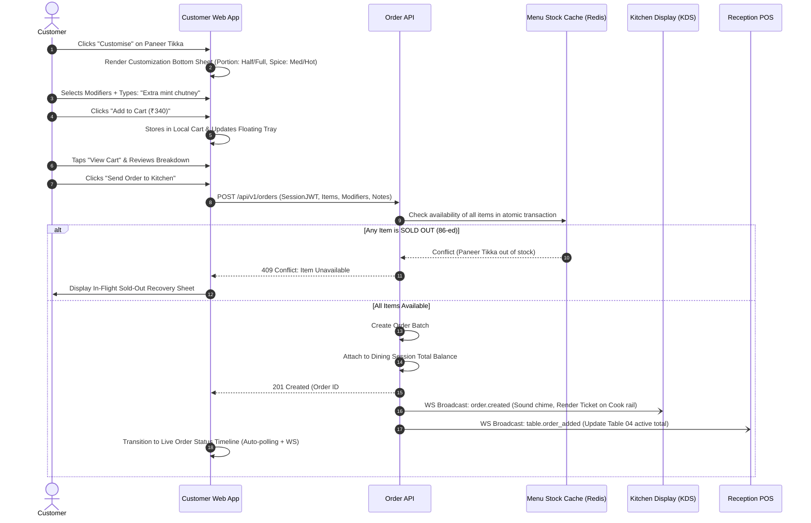
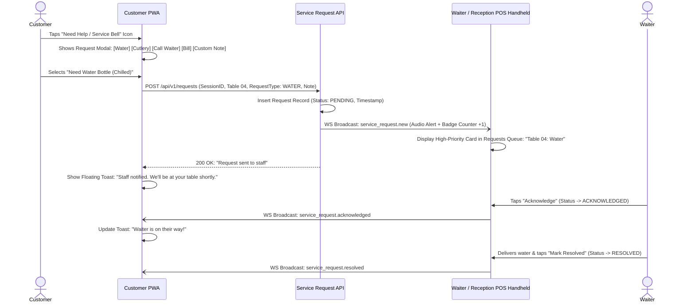
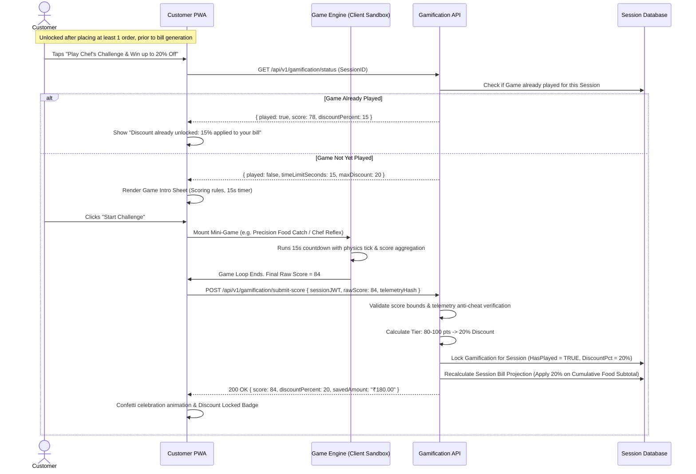
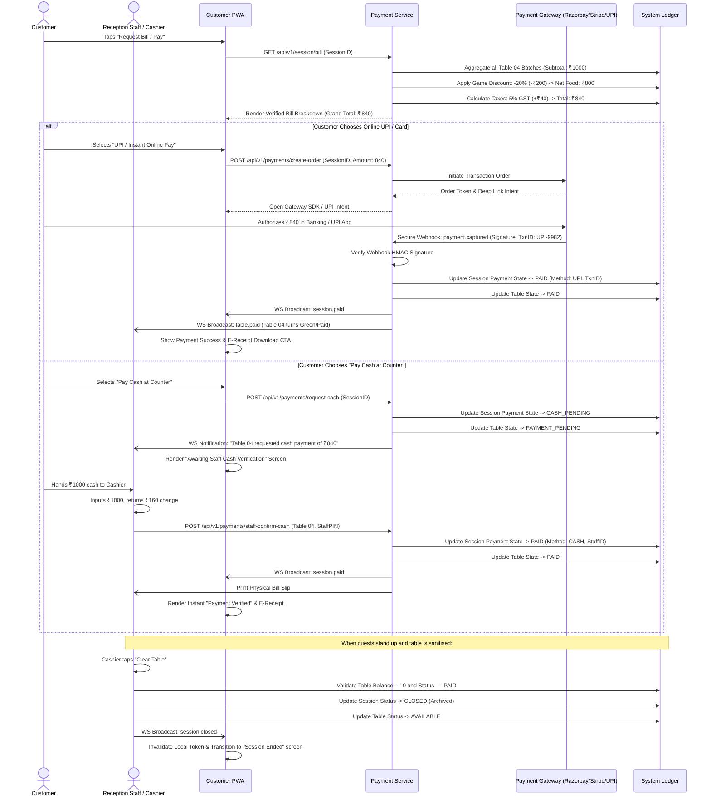

# RESTAURANT DIGITAL ORDERING PLATFORM
## 01. PRODUCT ARCHITECTURE & INFORMATION ARCHITECTURE

---

## 1. PRODUCT ARCHITECTURE & SYSTEM TOPOLOGY

The platform is an enterprise-grade, omni-channel restaurant operations and ordering suite. It replaces disconnected legacy hardware (dumb paper menus, proprietary point-of-sale terminals, separate kitchen printers, and manual billing books) with a unified, real-time, event-driven reactive ecosystem.

### 1.1 Four Integrated Subsystems

```
                                  ┌─────────────────────────────────────────────────────────┐
                                  │               DISTRIBUTED CLOUD BACKEND                 │
                                  │  • Session State Engine  • Order Routing & Aggregator   │
                                  │  • Payment Webhook Hub   • Real-Time WebSocket Cluster  │
                                  │  • Menu Stock Manager    • Role-Based Access (RBAC)     │
                                  └────────────┬─────────────┬─────────────┬────────────────┘
                                               │             │             │
                    ┌──────────────────────────┘             │             └──────────────────────────┐
                    ▼                                        ▼                                        ▼
    ┌───────────────────────────────┐        ┌───────────────────────────────┐        ┌───────────────────────────────┐
    │     CUSTOMER ORDERING PWA     │        │   RECEPTION / POS DASHBOARD   │        │     KITCHEN DISPLAY (KDS)     │
    │  • Viewport: Mobile (320-430) │        │  • Viewport: Tablet / Desktop │        │  • Viewport: 1080p / Touch    │
    │  • Zero install (QR driven)   │        │  • Live floorplan & billing   │        │  • Glancable ticket queue     │
    │  • Ephemeral session binding  │        │  • Staff-assisted ordering    │        │  • Bump bar / Touch actions   │
    │  • Real-time order tracking   │        │  • Cash collection audit      │        │  • Zero customer/payment info │
    └───────────────────────────────┘        └───────────────┬───────────────┘        └───────────────────────────────┘
                                                             │
                                                             ▼
                                             ┌───────────────────────────────┐
                                             │     OWNER / ADMIN PORTAL      │
                                             │  • Viewport: Desktop / Tablet │
                                             │  • Catalog & modifier manager │
                                             │  • Table & QR batch generator │
                                             │  • Financials & game config   │
                                             └───────────────────────────────┘
```

#### A. Subsystem 1: Customer Mobile Web (PWA / Web-First)
* **Target Device**: Smartphones (iOS Safari, Android Chrome). 320px–430px primary viewport.
* **Bootstrapping**: Scans high-entropy dynamic or signed cryptographic table QR code (`https://dine.restoname.com/t/:restaurantId/:tableId?token=:sessionToken`). Zero native app installation required.
* **Core Responsibilities**: Real-time session validation, interactive categorized digital menu, real-time item availability reflection, dynamic modifier customization, cart validation, multi-order placement within an active session, real-time ticket progress tracking, in-session service requests (waiter, water, cutlery, bill), skill-based gamification micro-experience, payment gateway interaction, and digital itemized receipt generation.
* **Security & Session Invariant**: The client holds an ephemeral JWT scoped strictly to the current active `dining_session_id`. It cannot read or modify other table sessions and cannot self-certify payments.

#### B. Subsystem 2: Reception & Operations Dashboard (POS Terminal)
* **Target Device**: Tablets (iPad 10.2", Galaxy Tab 11") and POS Desktops (1280px–1920px).
* **Core Responsibilities**: Real-time floor plan visualization (color-coded table states: AVAILABLE, ACTIVE, PAYMENT PENDING, PAID, CLOSED), central multi-order tracking per table, staff-assisted order entry (using the exact same backend engine as QR orders), physical cash reconciliation and manual payment certification, waiter service call dispatch and resolution, real-time 86-ing (marking menu items SOLD OUT), and table clearing control.
* **Critical Operational Invariant**: Staff cannot mark a table "CLOSED" or "AVAILABLE" if the cumulative dining session balance has an unpaid balance.

#### C. Subsystem 3: Kitchen Display System (KDS)
* **Target Device**: 15" to 24" wall-mounted or counter-mounted touchscreens (1080p, 1920x1080) and hardware bump-bars.
* **Core Responsibilities**: High-contrast, distance-readable (3–5 meters), low-cognitive-load order fulfillment pipeline. Displays active tickets categorized by preparation station (Grill, Fryer, Curry, Pantry, Beverages).
* **Data Isolation Invariant**: The kitchen interface strictly displays operational culinary data: Table Number, Ticket Number, Elapsed Timer, Order Items, Quantity, Item Modifiers, and Special Cooking Instructions. The KDS **never** exposes customer names, phone numbers, payment details, prices, discounts, or revenues.

#### D. Subsystem 4: Owner / Admin Management Portal
* **Target Device**: Desktop and Laptop viewports (1280px–1920px).
* **Core Responsibilities**: Global restaurant configuration, multi-room dining table layout configuration, cryptographic QR code batch generation/export (print-ready SVG/PDF), menu catalog hierarchy (categories, subcategories, tags, allergens, GST tax slabs, modifier matrix), inventory availability, staff identity and granular Role-Based Access Control (RBAC), game scoring rules and session discount ceilings, consolidated financial reporting, and tax audit logs.

---

## 2. INFORMATION ARCHITECTURE (IA)

### 2.1 Customer Mobile Information Architecture

```
[QR SCAN]
   │
   ├─► [INVALID / STALE QR] ──► [Session Closed Error Screen] ──► [Call Waiter Action]
   │
   └─► [VALID ACTIVE SESSION]
          │
          ├──► [PERSISTENT HEADER]
          │       ├─ Table Badge & Restaurant Identity
          │       ├─ Search Input & Category Filter Triggers
          │       └─ Service Bell Action Sheet (Water, Cutlery, Waiter, Clean Table)
          │
          ├──► [MENU EXPLORATION]
          │       ├─ Category Sticky Pills (Starters, Mains, Breads, Rice, Beverages, Desserts)
          │       ├─ Dietary Filter Bar (Veg, Non-Veg, Egg, Bestseller, Spice Level)
          │       ├─ Food Cards (Image, Diet Badge, Name, Price, Description, Quick ADD)
          │       └─ Product Detail Bottom Sheet (Full description, Allergen info, Modifiers)
          │
          ├──► [FLOATING DOCK / CART TRAY] (Visible when cart items > 0)
          │       ├─ Item Count & Running Subtotal
          │       └─ "View Cart" Trigger
          │
          ├──► [CART & CHECKOUT DRAWER]
          │       ├─ Itemized Cart Items + Inline Quantity Controls
          │       ├─ Cooking Instructions / Allergy Notes
          │       ├─ Order Summary (Items Subtotal, Projected Taxes)
          │       └─ CTA: "Send Order to Kitchen"
          │
          ├──► [ACTIVE SESSION TIMELINE HUB] (Primary view once orders are submitted)
          │       ├─ Live Kitchen Status Tracker (Submitted ➔ Preparing ➔ Ready ➔ Served)
          │       ├─ Cumulative Table Order History (Batch 1, Batch 2, etc.)
          │       ├─ CTA: "Add More Items" (Navigates back to menu catalog)
          │       ├─ CTA: "Play & Win Discount" (Unlocked before bill generation)
          │       │      ├─ Game Intro & Rules (Max 20% discount on final bill)
          │       │      ├─ 15-Second Interactive Skill Challenge
          │       │      └─ Result & Session Discount Applied Voucher
          │       └─ CTA: "Request Bill / Pay Now"
          │
          ├──► [SETTLEMENT & PAYMENT]
          │       ├─ Consolidated Table Bill Breakdown:
          │       │     • All Food Batches Subtotal
          │       │     • Game Discount Deduction (Applied to cumulative food subtotal)
          │       │     • GST / Service Charge
          │       │     • Grand Total Due
          │       ├─ Payment Method Selector:
          │       │     • Instant UPI (Intent flow / QR modal)
          │       │     • Credit / Debit Card (Secure Hosted Fields)
          │       │     • Cash / Pay at Counter (Triggers Staff Confirmation Request)
          │       └─ Payment Pending Verification State (Auto-polling + WebSocket listener)
          │
          └─► [POST-PAYMENT & DEPARTURE]
                  ├─ Payment Success Badge
                  ├─ Download Itemized Tax E-Receipt (PDF)
                  ├─ Optional Feedback Rating (Food, Ambiance, Speed)
                  └─ "Finish Dining" (Clears local session token)
```

### 2.2 Reception & Operations Dashboard Information Architecture

```
[OPERATIONS POS NAVIGATION]
   │
   ├──► [1. FLOOR PLAN & TABLES (Default View)]
   │       ├─ Metric Header: Total Tables, Active Tables, Available, Payment Pending
   │       ├─ Room / Section Filter: Main Dining, Patio, Rooftop, Private Cabanas
   │       └─ Interactive Table Matrix:
   │             ├─ Table Card (Table #, Capacity, Time Seated, Server Name, Amount Due)
   │             ├─ Color-Coded State Border (Green: Available, Amber: Active, Purple: Pay Pending)
   │             └─ Quick Table Drawer:
   │                   ├─ Detailed Order List (Batch breakdowns with timestamps)
   │                   ├─ Add Items (Staff-assisted ordering)
   │                   ├─ Print Bill / Send Digital Bill
   │                   ├─ Settle Bill (Cash / Card POS Terminal / Online Override)
   │                   └─ Clear Table (Disabled until balance = 0)
   │
   ├──► [2. LIVE ORDER FEED (Kanban / Chronological List)]
   │       ├─ Column 1: New Orders (Needs Kitchen Acknowledgment)
   │       ├─ Column 2: In Kitchen Preparation (Live preparation timers)
   │       ├─ Column 3: Ready for Pickup / Runner Dispatch
   │       └─ Column 4: Delivered / Served to Table
   │
   ├──► [3. SERVICE REQUESTS INBOX]
   │       ├─ Priority Queue: Water Request, Cutlery Request, Waiter Call, Bill Request
   │       ├─ Elapsed Response Timer (Alert changes to red after 3 minutes)
   │       └─ "Acknowledge" and "Mark Resolved" Actions
   │
   ├──► [4. BILLING & PAYMENTS]
   │       ├─ Unsettled Bills (Awaiting customer online payment or cash staff confirmation)
   │       ├─ Cash Payment Approval Modal: Table #, Subtotal, Applied Discount, Staff PIN
   │       └─ Daily Shift Ledger & Cash Drawer Balance
   │
   ├──► [5. LIVE MENU 86-ING (Availability Toggle)]
   │       ├─ Instant Search & Quick Category Filters
   │       └─ One-tap "IN STOCK" / "SOLD OUT" Switch (Pushes instantaneous WebSocket broadcast)
   │
   └──► [6. QR CODE MANAGEMENT]
           ├─ Table QR Generation & Batch Print
           └─ Emergency Session Reset / Token Regeneration
```

### 2.3 Kitchen Display System (KDS) Information Architecture

```
[KDS DISPLAY SURFACE]
   │
   ├──► [TOP BAR: SYSTEM STATUS]
   │       ├─ Station Indicator: [ALL STATIONS] / [GRILL & TANDOOR] / [CURRY] / [PANTRY]
   │       ├─ Active Tickets Count | Average Preparation Time: 12m 40s
   │       ├─ System Time & WebSocket Connection Heartbeat
   │       └─ Sound Notification Toggle (Audio chime on new order arrival)
   │
   └──► [MAIN VIEWPORT: DYNAMIC TICKET CAROUSEL / GRID]
           │
           ├─► [ORDER TICKET CARD]
           │      ├─ Header:
           │      │     • Table Number (Large Display: e.g., T-04)
           │      │     • Order / Ticket ID (#1042-B2)
           │      │     • Chronometer Timer (00:00 ➔ Yellow at 10m ➔ Red Flash at 15m)
           │      │     • Batch Tag (e.g., "Round 2 / Add-on")
           │      │
           │      ├─ Body (Itemized List):
           │      │     • Item Quantity (e.g., "2x") in Bold Accent
           │      │     • Item Name (e.g., "Butter Chicken")
           │      │     • Modifier Pills (e.g., "Boneless", "Mild Spice")
           │      │     • CRITICAL: High-Vis Special Instruction Callout ("NO CORIANDER / PEANUT ALLERGY")
           │      │     • Item-level strike-off toggle (Cook can tap item as done)
           │      │
           │      └─ Footer: Primary Step Action CTA
           │            • NEW ──► [START PREPARING] (Changes color & starts prep phase)
           │            • PREPARING ──► [MARK READY] (Alerts floor runner & POS)
           │            • READY ──► [MARK SERVED / BUMP] (Removes from active cook rail)
           │
           └─► [EMERGENCY 86 NOTIFIER]
                  └─ "Report Out of Stock" Quick Button (Sends instant alert to POS & Admin)
```

---

## 3. COMPLETE USER FLOWS

### 3.1 Flow A: QR Code Scan & Session Bootstrapping



### 3.2 Flow B: Menu Customization, Cart & Multi-Batch Ordering



### 3.3 Flow C: Waiter / Floor Service Requests



### 3.4 Flow D: Gamification & Session Discount Calculation



### 3.5 Flow E: Settlement & Payment Reconciliation



---

## 4. SCREEN INVENTORY & ARCHITECTURAL HIERARCHY

### 4.1 Customer PWA (27 Distinct Functional States)

| # | Screen / State Identifier | Visual Format | Primary Purpose & Contents |
|---|---|---|---|
| 01 | `SCR-CUST-01-QR-LANDING` | Splash / Skeleton | Camera redirects here; validates cryptographic table token; shows restaurant branding and loading spinner. |
| 02 | `SCR-CUST-02-START-DINING` | Modal / Hero Sheet | Confirms Table Number (e.g. "Table 04 - Terrace"); asks for primary diner name (optional); CTA "Start Ordering". |
| 03 | `SCR-CUST-03-MENU-HOME` | Full Page (Sticky Nav) | Master catalog: brand header, table tag, search trigger, horizontal category tabs, dietary toggles, food cards. |
| 04 | `SCR-CUST-04-SEARCH` | Full Page Overlay | Live debounced search with recent searches, popular keywords, and instant item results grouped by category. |
| 05 | `SCR-CUST-05-CATEGORY-VIEW` | Filtered View | Deep-dive category list (e.g. "Rice & Biryani") with subcategory chips (Veg, Chicken, Mutton). |
| 06 | `SCR-CUST-06-PRODUCT-DETAIL` | Bottom Sheet (Half/Full) | High-res food imagery, veg/non-veg badge, calories, allergen tags, detailed story/ingredients, and modifier trigger. |
| 07 | `SCR-CUST-07-CUSTOMIZATION` | Bottom Sheet Drawer | Radio buttons for mandatory groups (Portion Size), Checkboxes for add-ons (Extra Cheese), Special instructions text area. |
| 08 | `SCR-CUST-08-CART` | Slide-Over Drawer | Itemized list with +/- controls, cooking instructions input, itemized price subtotal, estimated GST, CTA "Place Order". |
| 09 | `SCR-CUST-09-ORDER-CONFIRM` | Full Page State | Brief 3-second animated success circle ("Order Sent to Kitchen!") before routing to live tracker. |
| 10 | `SCR-CUST-10-ORDER-TRACKING` | Full Page Hub | Live status stepper (Submitted ➔ Cooking ➔ Ready ➔ Served), elapsed preparation progress, itemized batch list. |
| 11 | `SCR-CUST-11-ADD-MORE-ITEMS` | Dynamic Catalog State | Preserves active order bar at top while opening menu catalog for Round 2 / additional food requests. |
| 12 | `SCR-CUST-12-GAME-INTRO` | Gamification Modal | "Chef's Flavour Catch": Clean typography explaining 15-second game rules, tier discounts (0-20%), and single-attempt policy. |
| 13 | `SCR-CUST-13-GAME-PLAY` | Interactive Canvas | 15-second responsive HTML5/Canvas mini-game; fluid, high-frame-rate interaction; real-time score display. |
| 14 | `SCR-CUST-14-GAME-RESULT` | Celebration Modal | Score reveal, tier badge ("Master Chef - 20% OFF"), confetti, and persistent session discount voucher confirmation. |
| 15 | `SCR-CUST-15-BILL-VIEW` | Full Page / Sheet | Comprehensive table bill: All batches, itemized breakdown, -20% game discount deduction, 5% GST, Grand Total. |
| 16 | `SCR-CUST-16-PAYMENT-METHOD` | Sheet Selector | Payment channels: Instant UPI (GPay, PhonePe, Paytm), Credit/Debit Card, or "Pay at Counter (Cash/Card POS)". |
| 17 | `SCR-CUST-17-PAYMENT-PROCESSING`| Blocking Screen | Gateway handshake verification; animated spinner; advisory: "Please do not close or refresh this tab". |
| 18 | `SCR-CUST-18-PAYMENT-FAILED` | Error Sheet | Clear failure reason from gateway; retry CTA; secondary action to switch to Cash or call staff. |
| 19 | `SCR-CUST-19-PAYMENT-SUCCESS` | Success Screen | Prominent green checkmark, Transaction ID, Table Number, Total Paid, and immediate "Download Receipt" CTA. |
| 20 | `SCR-CUST-20-E-RECEIPT` | Printable / PDF View | Official GST tax invoice layout: Restaurant details, GSTIN, FSSAI, itemized orders, discounts, payment method, timestamp. |
| 21 | `SCR-CUST-21-NEED-HELP` | Action Sheet | Service requests: "Request Water", "Extra Cutlery", "Call Waiter", "Clean Table", or custom staff note. |
| 22 | `SCR-CUST-22-REQUEST-SUBMITTED`| Toast / Banner | Feedback banner confirming request sent; displays waiter acknowledgment state. |
| 23 | `SCR-CUST-23-ITEM-UNAVAILABLE` | Alert Sheet | Informs diner that an in-flight or cart item just sold out; offers instant replacement or removal. |
| 24 | `SCR-CUST-24-REPLACEMENT-SELECT`| Modal Sheet | Curated similar available dishes within same category with 1-tap swap action. |
| 25 | `SCR-CUST-25-SESSION-CLOSED` | Full Page Lockout | Rendered when an old QR photo is scanned or after table is cleared: "Session Ended. Please ask staff to seat you." |
| 26 | `SCR-CUST-26-NO-ACTIVE-TABLE` | Full Page Error | Handles unregistered or deactivated QR tokens: "Invalid table QR. Please scan the QR placed on your table." |
| 27 | `SCR-CUST-27-CONNECTION-LOST` | Persistent Banner | Amber network reconnecting banner; retains local cart in IndexedDB; disables checkout until connection recovers. |

---

### 4.2 Reception & POS Operations Dashboard (Core Screens)

| # | Screen Identifier | Primary Layout | Primary Operational Capabilities |
|---|---|---|---|
| 01 | `SCR-REC-01-FLOOR-PLAN` | Dynamic Grid / Canvas | Floor overview showing all tables with color-coded status, capacity, occupancy duration, server, and running total. |
| 02 | `SCR-REC-02-TABLE-DETAIL` | Split Master-Detail | Selected table deep-dive: all placed batches, modifier details, service requests, bill summary, and action drawer. |
| 03 | `SCR-REC-03-ORDER-STREAM` | 4-Column Kanban | Live kitchen order tickets categorized by status (New, Preparing, Ready, Served) with time-in-state badges. |
| 04 | `SCR-REC-04-SERVICE-REQUESTS` | Priority Drawer / Inbox | Real-time queue of guest assistance calls (Water, Waiter, Cutlery) with timer escalation and one-tap resolve. |
| 05 | `SCR-REC-05-BILLING-REGISTER` | Split Register View | Unsettled bills queue, discount audit, payment method confirmation (Cash approval dialog), and manual split billing. |
| 06 | `SCR-REC-06-MENU-STOCK-86` | Searchable Grid | Fast inventory toggles to instantly 86 (sell out) or restore items with immediate customer app synchronization. |
| 07 | `SCR-REC-07-STAFF-ORDER-ENTRY` | Touch POS Grid | Server-assisted ordering interface for walk-in guests or guests without smartphones, linking directly to Table Session. |
| 08 | `SCR-REC-08-QR-MANAGEMENT` | Table QR Directory | Status of QR tokens, print/reprint individual or batch QR stands, and emergency session reset. |

---

### 4.3 Kitchen Display System (KDS Screens)

| # | Screen Identifier | Primary Layout | Primary Operational Capabilities |
|---|---|---|---|
| 01 | `SCR-KDS-01-TICKET-RAIL` | Horizontal Multi-Card Rail | Active cooking tickets arranged by FIFO (First In First Out), with visual color urgency (Normal ➔ Warning ➔ Overdue). |
| 02 | `SCR-KDS-02-STATION-VIEW` | Station Filter Rail | Filter orders by prep station: Tandoor/Grill, Pan/Curry, Fryer/Appetizers, Pantry/Salads, Beverage Bar. |
| 03 | `SCR-KDS-03-ITEM-AGGREGATOR` | Summary Bar / Sidebar | "All Day" view: Aggregates total quantities of identical items currently in prep across all tables (e.g. "Total Butter Naan: 14"). |
| 04 | `SCR-KDS-04-RECALL-HISTORY` | Drawer / Overlay | Recently bumped/served tickets with instant "Recall Ticket" option in case of accidental touch dismissal. |

---

### 4.4 Owner & Admin Portal (Core Screens)

| # | Screen Identifier | Primary Layout | Primary Operational Capabilities |
|---|---|---|---|
| 01 | `SCR-ADM-01-ANALYTICS` | Analytics Dashboard | Real-time revenue, average ticket size, table turnaround times, category popularity, hourly peak occupancy curves. |
| 02 | `SCR-ADM-02-MENU-BUILDER` | Tree / Table Editor | Categories, items, description, dietary classification, tax rates (GST 5%/18%), price tiers, modifier groups builder. |
| 03 | `SCR-ADM-03-TABLE-LAYOUT` | Visual Layout / Matrix | Dining room setup (Ground Floor, Rooftop), table identifiers, seating capacities, and QR generation batch actions. |
| 04 | `SCR-ADM-04-STAFF-RBAC` | User Access Table | Employee directory, role assignments (Manager, Waiter, Cashier, Chef, Admin), passcodes, and audit activity logs. |
| 05 | `SCR-ADM-05-GAME-DISCOUNT-CFG` | Settings Matrix | Enable/disable gamification, configure tier thresholds (0-19, 20-39, etc.), maximum discount cap (default 20%), expiration. |
| 06 | `SCR-ADM-06-TAX-PAYMENT-CONFIG` | Settings / Compliance | Gateway API keys (Razorpay/Stripe), UPI VPA setup, GSTIN number, legal restaurant header, receipt footer terms. |
